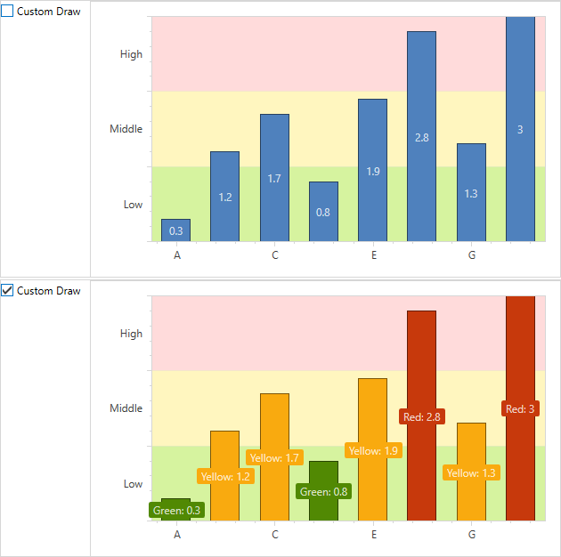

<!-- default badges list -->

<!-- default badges end -->

# Chart for WPF - How to custom draw chart series points

This example shows how to change the color of each series point according to its values.

In addition, the point labels text is changed to show the color of the current interval (Green, Yellow, or Red).

To accomplish this, it is necessary to invoke the [ChartControl.CustomDrawSeriesPoint](https://docs.devexpress.com/WPF/DevExpress.Xpf.Charts.ChartControl.CustomDrawSeriesPoint) event and change its drawing options in the `CorrectDrawOptions()` method.

In this example, you can deactivate the "Custom Draw" option on the stack panel to return to the default appearance of series points.

<!-- default file list -->
## Files to Review

* [MainWindow.xaml](./CS/CustomDrawChart/MainWindow.xaml) (VB: [MainWindow.xaml](./VB/CustomDrawChart/MainWindow.xaml))
* [MainWindow.xaml.cs](./CS/CustomDrawChart/MainWindow.xaml.cs) (VB: [MainWindow.xaml.vb](./VB/CustomDrawChart/MainWindow.xaml.vb))
<!-- default file list end -->
<!-- feedback -->
## Does this example address your development requirements/objectives?

 

(you will be redirected to DevExpress.com to submit your response)
<!-- feedback end -->
